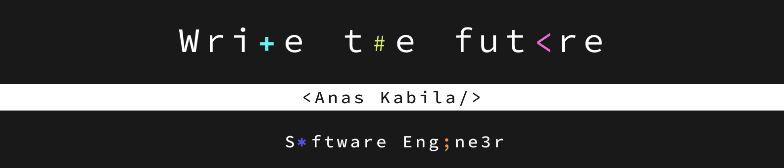

<h4 align="center"><samp> Software Engineer, An Open Source Contributor & A Competitive Programmer </samp></h4>

👨‍💻 &nbsp;About Me  
- <samp><b> As a Software Engineer, I bring a strong enthusiasm for tackling challenges and a commitment to continuous learning, along with a solid dedication to fostering teamwork and collaboration.
 </b> 
- <b> I believe that technology can play a crucial role in developing our country. That's why I aim to inspire and lead the growth of a strong Moroccan tech community 🌍. In order to do that I plan to create and support initiatives such as tech meetups 💬, and collaborative projects 💡, providing resources and opportunities that foster skills development and knowledge sharing within the community.🚀 </b>  
🤝🏻 &nbsp;Connect with Me

